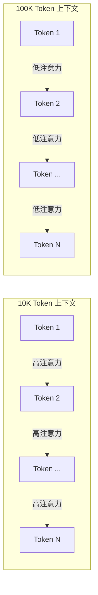
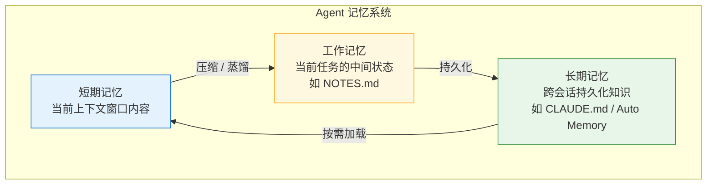
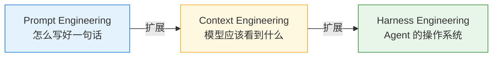

# 上下文工程：从 Prompt Engineering 到 Context Engineering 的范式跃迁

如果说 2023 年是 **Prompt Engineering** 的元年，那么 2026 年正在见证的，是它的自然演进——**Context Engineering（上下文工程）**。

2025 年 9 月，Anthropic 发表了一篇名为《Effective Context Engineering for AI Agents》的工程博客，正式定义了"上下文工程"这一概念。随后，Gartner 将"上下文"列为 2026 年 AI 领域最重要的关键词，前特斯拉 AI 负责人 Andrej Karpathy 公开表态"+1 for context engineering over prompt engineering"。

**一句话概括这次范式转移：**

> Prompt Engineering 关心的是 **"怎么写好一句话"**，  
> Context Engineering 关心的是 **"模型应该看到什么"**。

本文将从概念起源、核心技术、工具实践、与现有体系的关系四个维度，系统讲清楚这件事。

> 建议搭配阅读：
>
> - [Prompt 工程入门](prompt.md)
> - [RAG 技术（检索增强生成）](rag.md)
> - [Skill 使用介绍](skill.md)
> - [AI Agent 入门](agent.md)

---

## 1. 为什么需要从 Prompt Engineering 升级到 Context Engineering

### 1.1 Prompt Engineering 的局限

在过去几年里，Prompt Engineering 教会了我们很多技巧：角色设定、链式思考（CoT）、Few-Shot 示例、明确输出格式……这些技巧确实有效，但它们都有一个共同的前提假设：

> **你面对的是一个"空白的上下文窗口"，你要做的就是写好一段输入。**

但现实正在发生变化：

- **上下文窗口越来越大**：从 4K 到 128K 到 1M Token，模型能"看到"的信息量级翻了数十倍。
- **信息来源越来越多元**：不再只是你手写的 Prompt，还有 RAG 检索结果、工具调用返回、历史对话、项目文件、用户偏好……
- **任务越来越复杂**：从单轮问答变成了多步 Agent 任务，需要跨会话、跨工具的上下文管理。

这时候，"写好一句话"已经不够了。你需要回答的问题是：**在这 200K 的上下文窗口里，模型应该看到什么、不应该看到什么、信息的排列顺序是什么、什么时候加载、什么时候压缩？**

这就是 Context Engineering 要解决的问题。

### 1.2 一个直觉性的类比

可以把 LLM 的上下文窗口想象成一个人的**工作记忆**：

- 你让一个人同时阅读 10 页文档并回答问题，他大概率能抓住重点。
- 你让他同时阅读 1000 页文档并回答问题，即使给他足够的时间，他对每页细节的关注度也会显著下降。

Transformer 架构的注意力机制也是类似的：上下文中的每个 Token 都需要 attend 到其他所有 Token。**Token 越多，每个 Token 分到的"注意力预算"就越少。**

Context Engineering 的核心，就是管理好这个有限的注意力预算。

---

## 2. Anthropic 的原始定义与核心原则

### 2.1 定义

2025 年 9 月，Anthropic 在工程博客中给出了 Context Engineering 的正式定义：

> **"Strategies for curating and maintaining the optimal set of tokens... including all other information that may land there."**  
> （策划和维护最优 Token 集合的策略……包括所有可能进入上下文窗口的信息。）

注意这个定义里的两个关键词：

- **curating（策划）**：不是"把所有东西都塞进去"，而是精心筛选。
- **maintaining（维护）**：不是一次性的操作，而是跨多轮会话的持续管理。

### 2.2 四条核心原则

Anthropic 提出了四条指导性原则：

**1. 正确的海拔（Right Altitude）**

系统提示必须在"脆弱的 if-else 硬编码规则"和"模糊的高层指导"之间找到平衡。

- 过于具体：遇到边界情况就崩溃，规则越加越多，互相矛盾。
- 过于抽象：模型不知道该怎么做，输出不稳定。

好的做法是给出"足够具体的方向 + 典型示例"，而不是穷举所有边缘情况。

**2. 工具设计的自律性**

工具（Tools）应该是自包含的、对错误健壮的、极度清晰的。如果一个人类工程师都无法确定在某个场景下该调用哪个工具，那 AI Agent 也不行。

**3. 示例优于规则列表**

提供几个精心挑选的典型示例（canonical examples），远比列一长串边缘情况的规则更有效。这本质上是在利用模型的 Few-Shot 学习能力来"理解"上下文中的意图。

**4. 子代理架构**

对于深度任务，使用专门化的子代理（sub-agent），让它完成工作后返回"浓缩的、蒸馏过的摘要"给主协调代理。这避免了主代理的上下文被大量中间过程淹没。

---

## 3. 关键概念详解

### 3.1 注意力预算管理（Attention Budget Management）

这是 Context Engineering 最核心的概念之一。

**核心洞察：** LLM 的注意力是一种有限的认知资源，类似于人类的工作记忆容量。

- 每引入一个新 Token，都在消耗注意力预算。
- Transformer 中每个 Token 需要 attend 到所有其他 Token，这是 O(n²) 的关系。
- 当上下文从 10K Token 增长到 100K Token 时，每个 Token 获得的"关注度"大幅下降。

这就是为什么"塞更多信息"不一定等于"得到更好的结果"——信息越多，单条信息的被关注度越低，这就是**注意力稀释（Attention Dilution）**。



### 3.2 上下文腐烂（Context Rot）

这是 Anthropic 内部发现的一个重要问题，也是上下文工程要解决的核心挑战之一。

**定义：** 随着上下文窗口中 Token 数量的增加，以及时间的推移，模型准确回忆和运用信息的能力显著下降。

**关键数据：**

- Anthropic 内部发现，其分析系统的**离线准确率在一个月内从约 95% 降至约 65%**——原因就是数据模型变更、技能文档过时。
- 研究表明，模型对上下文中间部分信息的召回率会显著降低（即"Lost in the Middle"效应）。

**规则退化问题（Rules Degradation）：**

Anthropic 发现了一个令人不安的现象：**加一条新规则，所有已有规则的遵守度都会同步下降一点点**。不是某几条失效，而是整体的注意力预算被稀释，导致所有规则的执行质量同步降低。

这意味着：系统提示不是越长越好，每多加一条规则，你都在用所有其他规则的可靠性来"交换"。

### 3.3 上下文窗口优化

**上下文窗口 ≠ 越大越好。** 即使现代模型支持 128K（GPT-5.x）、200K（Claude）、甚至 1M（Claude Code）的上下文窗口，更大的窗口并不等于更好的表现。

三种核心优化策略：

- **即时检索（Just-in-Time Retrieval）**：Agent 在运行时动态加载所需数据到上下文中，而非预先加载所有内容。
- **压缩（Compaction）**：对历史记录进行"高保真度蒸馏"，总结关键信息，丢弃冗余的工具输出。
- **结构化笔记（Structured Note-Taking）**：通过文件（如 `NOTES.md`、`CLAUDE.md`）持久化状态，在上下文重置时维持连贯性。

---

## 4. 六大实用技术

### 4.1 选择性检索（Selective Retrieval）

不是把所有检索结果都塞进上下文，而是精确筛选：

- 按元数据过滤（如 `region='CN'`、`date >= 2026`）
- 使用 Cross-Encoder 进行重排序
- 余弦相似度 > 0.9 的结果去重

**效果：** 准确率提升约 30%，Token 节省约 40%。

### 4.2 上下文压缩（Context Compression）

在放入上下文之前，将长源文档压缩为密度高、与任务强相关的摘要：

```python
# 上下文压缩示例（伪代码）
def compress_context(documents: list[str], max_tokens: int) -> str:
    """将多份文档压缩为固定 Token 预算内的高密度摘要"""
    
    # 1. 对每份文档进行句子级评分
    scored_sentences = []
    for doc in documents:
        sentences = split_sentences(doc)
        scores = relevance_score(sentences, query)  # 用轻量模型评分
        scored_sentences.extend(zip(sentences, scores))
    
    # 2. 按相关性排序，保留 Top 20% 最相关的句子
    scored_sentences.sort(key=lambda x: x[1], reverse=True)
    top_sentences = scored_sentences[:len(scored_sentences) // 5]
    
    # 3. 按原文顺序重组，确保 Token 不超预算
    result = reorder_and_join(top_sentences, max_tokens)
    return result

# 原始上下文：20,000 tokens
# 压缩后：约 4,000 tokens（减少 80%）
# 准确率：基本持平
```

**效果：** Token 减少 50-75%，准确率基本持平。

### 4.3 层次化布局（Hierarchical Layout）

上下文中的信息排列顺序直接影响模型的注意力分配。推荐的结构：

```
[System Rules]         → 系统规则（最高优先级，放在最前）
[Task Description]     → 当前任务描述
[User Profile]         → 用户画像与偏好
[Retrieved Context]    → RAG 检索到的上下文
[Tool Output]          → 工具调用结果
[Question]             → 最终问题（放在最后，靠近生成位置）
```

这和人类阅读的习惯不同——对于 LLM 来说，**开头和结尾的信息获得的注意力最多**，中间部分最容易被"遗忘"。所以最重要的规则和最终的问题应该分别放在最前面和最后面。

**效果：** 准确率提升约 10-20%。

### 4.4 动态查询改写（Dynamic Query Rewriting）

用户的原始查询往往模糊或不完整，需要改写为更精确的检索查询：

- **HyDE（Hypothetical Document Embedding）**：先让模型生成一份"理想回答"，再用这份回答去做向量检索。
- **多查询扩展（Multi-Query Expansion）**：将一个查询改写为多个角度的查询，合并结果。
- 自动添加时间范围、实体、指标等约束条件。

### 4.5 记忆与状态管理（Memory & State Management）

将不同类型的记忆分开管理，而非混在一起：



**三层记忆的对应关系：**

| 记忆类型 | 类比 | AI 实现 | 生命周期 |
|:---------|:-----|:--------|:---------|
| 情景记忆（Episodic） | 上周的会议记录 | 特定交互的摘要 | 会话级 |
| 语义记忆（Semantic） | 你的专业知识库 | 向量化知识库（RAG） | 持久 |
| 程序记忆（Procedural） | 你的工作习惯和偏好 | 用户偏好、行为模式 | 持久 |

**效果：** 将 20K Token 的历史对话压缩为约 1.8K Token 的聚焦记忆，Token 减少 91%。

### 4.6 工具感知上下文（Tool-Aware Context）

将工具输出的结构化数据直接、规范地注入上下文：

- 通过 [MCP 协议](mcp.md) 标准化工具输出的格式。
- 确保 Agent 基于实时数据（如 API 返回的实时价格）而非训练数据做决策。
- 将答案锚定在真实数据上，减少幻觉。

---

## 5. 主流工具的上下文工程实践

### 5.1 Claude Code

Claude Code 是目前 Context Engineering 实现最成熟的工具之一：

| 机制 | 说明 | 对应的 CE 原则 |
|:-----|:-----|:---------------|
| **CLAUDE.md** | 最大 200 行的项目规则文件，存放架构约定、编码规范 | "正确的海拔"原则 |
| **Auto Memory** | 跨会话记忆系统，自动持久化学习成果 | 长期记忆管理 |
| **`/compact` 命令** | 压缩当前上下文，解决 Context Rot | 上下文压缩 |
| **Skills 系统** | 可复用的知识包，按需加载 | 即时检索（JIT） |
| **1M Token 窗口** | 超大上下文窗口 + 精细管理 | 注意力预算管理 |

Claude Code 的分层记忆机制尤其值得关注：

```
┌─────────────────────────────────────┐
│  Level 3: 运行时上下文               │  ← 当前任务的文件、工具输出
├─────────────────────────────────────┤
│  Level 2: 自动记忆 (Auto Memory)     │  ← 跨会话的学习成果
├─────────────────────────────────────┤
│  Level 1: CLAUDE.md（静态规则层）     │  ← 项目规则、编码风格
└─────────────────────────────────────┘
```

这体现了 Context Engineering 中"渐进式披露"（Progressive Disclosure）的设计思想：不是把所有信息一股脑塞进去，而是分层加载、按需披露。

### 5.2 Cursor

Cursor 的上下文工程走的是"语义索引 + 多源融合"的路线：

| 机制 | 说明 | 对应的 CE 原则 |
|:-----|:-----|:---------------|
| **Codebase Indexing** | 自动对工作区代码进行向量化嵌入，建立语义索引 | 选择性检索 |
| **`@Codebase` / `@Files` / `@Docs`** | 多源上下文引用系统 | 多源上下文融合 |
| **`.cursorrules`** | 项目级行为规则文件 | "正确的海拔"原则 |
| **智能上下文推荐** | 通过语义索引主动推荐相关代码片段 | 自动上下文选择 |

Cursor 的 Codebase Indexing 本质上是一种 **RAG 实现**——它对代码库进行向量化索引，然后在用户提问时语义检索最相关的代码片段注入上下文。

### 5.3 其他工具

- **GitHub Copilot**：通过 workspace context 提供项目级理解。
- **Windsurf（Codeium）**：Cascade 功能实现跨文件的上下文追踪。
- **Augment Code**：专注企业级代码库的语义索引和上下文管理。

---

## 6. Harness Engineering：更进一步的演进

在 Context Engineering 的基础上，Phil Schmid 等人提出了 **Harness Engineering** 的概念，将视角从"管理上下文"进一步扩展到"构建 Agent 的操作系统"。

**核心公式：**

> **Agent = Model + Harness**

> "The model is the CPU... The agent harness is the operating system."  
> （模型是 CPU……Agent Harness 是操作系统。）——Phil Schmid

**Harness 的两大核心组件：**

- **Guides（引导）**：如 `AGENTS.md`、`CLAUDE.md` 文件，为 Agent 提供项目上下文和行为指南。
- **Sensors（传感器）**：Observation Loops，让 Agent 能够监控自己的行为并自我纠正。

Harness Engineering 的上下文压缩技术可以实现 **98.7% 的 Token 使用量减少**，同时保持任务完成能力。

可以这样理解三者的演进关系：



---

## 7. Context Engineering 与现有体系的关系

### 7.1 与 Prompt Engineering 的关系

| 维度 | Prompt Engineering | Context Engineering |
|:-----|:-------------------|:-------------------|
| **核心问题** | "我怎么写指令让模型做对？" | "模型应该看到什么信息才能做对？" |
| **作用范围** | 单次输入的措辞优化 | 整个上下文窗口的信息管理 |
| **时间维度** | 通常是单轮优化 | 跨多轮会话的动态管理 |
| **信息来源** | 手动编写的文本 | 多源融合（RAG、记忆、工具、文件等） |
| **本质** | 语言技巧 | 系统工程 |

**一句话总结：** Prompt Engineering 是 Context Engineering 的子集——写好 Prompt 只是填充上下文窗口的一种方式。

### 7.2 与 RAG 的关系

**RAG 是 Context Engineering 的一个子集，而非对等关系。**

- **RAG** 解决的是"从哪里检索信息"的问题。
- **Context Engineering** 解决的是"检索什么、如何组织、何时加载、如何压缩"的全局问题。

随着模型上下文窗口增长到 200K+，一些观点认为"长上下文可以替代 RAG"。但实际上：

- 长上下文 ≠ 好上下文。把整个代码库塞进 200K 窗口会导致严重的 Context Rot。
- **最佳实践是 RAG + 长上下文的混合策略**：用 RAG 做粗粒度筛选，用长上下文做细粒度推理。

（这部分可以配合阅读：[RAG 技术（检索增强生成）](rag.md)）

### 7.3 与 Skill 系统的关系

**Skill 本质上就是上下文工程的一种实践。**

- Skill 是"预打包的、可复用的上下文片段"。
- 通过按需加载 Skill，避免每次都将所有知识塞入上下文。
- Skill 系统实现了 Anthropic 所说的"即时检索"（Just-in-Time Retrieval）原则。

Skill 的上下文工程特性：

- **延迟加载（Lazy Loading）**：只在需要时加载。
- **版本管理**：确保 Skill 文档不会"腐烂"。
- **作用域控制**：不同任务加载不同的 Skill 集合。

（这部分可以配合阅读：[Skill 使用介绍](skill.md)）

### 7.4 演进路径

三者的关系并非替代，而是层层递进的工程抽象：

```
基础 RAG          →  上下文工程          →  Agent Skill 系统
（检索信息）          （管理信息）            （封装 + 调度能力）
```

---

## 8. 开发者实操指南

### 8.1 如果你在用 Claude Code

1. **写好 CLAUDE.md**：遵循"正确的海拔"原则，给出架构约定和编码规范，而不是穷举规则。
2. **善用 `/compact`**：当上下文变长、模型开始"忘事"时，主动压缩上下文。
3. **维护 Auto Memory**：让 Claude Code 在跨会话中记住关键信息。
4. **编写 Skill**：把常用流程封装为可复用的知识包。

### 8.2 如果你在用 Cursor

1. **配置 `.cursorrules`**：定义项目级的行为指导和编码规范。
2. **善用 `@Codebase`**：让 Cursor 基于语义索引自动检索相关代码。
3. **手动 `@Files` / `@Docs`**：对关键文件和文档进行精确引用，而不是依赖自动检索。
4. **控制上下文规模**：不要在单次对话中引入过多文件和上下文。

### 8.3 如果你在构建自己的 Agent 系统

1. **分层管理上下文**：系统规则 → 任务描述 → 检索结果 → 工具输出 → 最终问题。
2. **实现上下文压缩**：对历史记录进行定期蒸馏和总结。
3. **分离记忆类型**：短期记忆（会话内）、工作记忆（任务状态）、长期记忆（跨会话）。
4. **工具输出标准化**：通过 MCP 等协议规范工具输出格式，方便模型理解。
5. **监控注意力预算**：关注上下文的 Token 总量，在信息丰富度和注意力稀释之间取得平衡。

---

## 9. Gartner 的判断与行业趋势

### 9.1 核心数据

Gartner 分析师孙鑫明确指出：

> **"当下企业 AI 的瓶颈，早已不是模型能力，而是上下文。"**

关键数据：

- **仅 4% 的企业**拥有就绪的数据基础设施来支撑上下文工程。
- 完成精准上下文治理的企业，**AI 效能提升 2 倍、准确率提升 40%、Token 消耗降低 70%**。
- **预计到 2028 年，80% 的 AI 工具将内置上下文工程能力**。

### 9.2 时间线

| 时间 | 里程碑 |
|:-----|:-------|
| 2023 年 | Prompt Engineering 成为热门话题，Few-Shot、CoT 等技术成熟 |
| 2024 年下半年 | 模型能力飞速提升，传统 Prompt 技巧开始显得力不从心 |
| 2025 年 6 月 | Andrej Karpathy 公开支持"Context Engineering"概念 |
| 2025 年 9 月 | Anthropic 发表《Effective Context Engineering for AI Agents》 |
| 2025 年 10 月 | Gartner 发布 2026 十大战略技术趋势，上下文技术被重点提及 |
| 2025 年底 | Claude Code、Cursor 等工具大规模实践 Context Engineering |
| 2026 年初 | Harness Engineering 概念兴起，进一步扩展为 Agent 操作系统 |
| 2026 年 | Gartner 宣布"上下文"为 AI 领域最重要关键词 |

---

## 10. 小结

Context Engineering 的重要性源于一个根本性的认知转变：

> **AI 系统表现的瓶颈，已经从"模型能力不足"转移到了"上下文管理不善"。**

模型已经足够强了，上下文窗口已经足够大了——但更大的窗口加上更多的信息，并不等于更好的表现。Context Engineering 的核心价值在于：**让每一个 Token 都用在刀刃上。**

它不是一种新的"提示词技巧"，而是一套完整的系统工程方法论——涵盖信息检索、记忆管理、注意力优化、工具集成、状态持久化等多个维度。

对开发者来说，掌握 Context Engineering 意味着从"如何对 AI 说话"升级为"如何为 AI 构建一个高效的信息环境"。这将是 2026 年及以后 AI 工程师最重要的核心技能。

---

**延伸阅读：**

- [Prompt 工程入门](prompt.md) — Context Engineering 的前置基础
- [RAG 技术（检索增强生成）](rag.md) — 上下文工程的重要子集
- [Skill 使用介绍](skill.md) — 预打包的可复用上下文片段
- [AI Agent 入门](agent.md) — Agent 记忆系统与上下文管理
- [What is MCP](mcp.md) — 工具感知上下文的标准化协议
- [深度推理与测试时计算](deep-reasoning.md) — 推理过程中的上下文利用
- [Agentic AI](agentic-ai.md) — Agentic 系统中的上下文编排

**参考文献：**

1. Anthropic. (2025). *Effective Context Engineering for AI Agents*. Anthropic Engineering Blog. https://www.anthropic.com/engineering/effective-context-engineering-for-ai-agents
2. Gartner. (2026). *2026 企业 AI 决胜成熟度与上下文工程*. Gartner Research.
3. Schmid, P. (2026). *Harness Engineering: The Most Important Skill in the Agentic AI Era*. Generative.inc.
4. Karpathy, A. (2025). *"+1 for context engineering over prompt engineering"*. X (Twitter).

---

**本文作者：** [<span class="author-avatar-wrapper"><span class="author-name-popover">王科文</span></span>](https://github.com/Wkwcowin)
