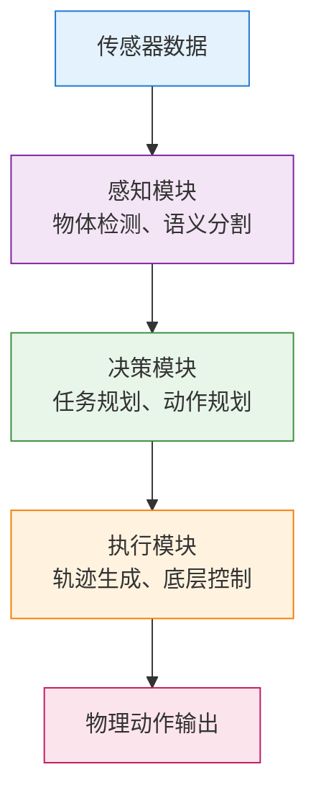
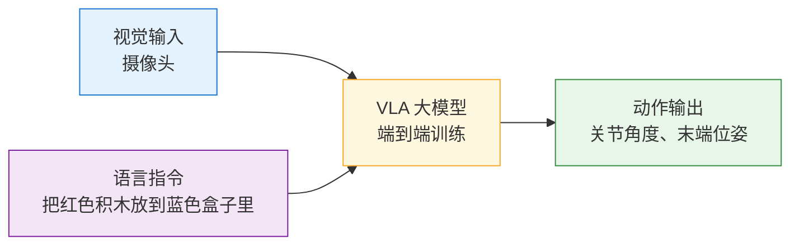
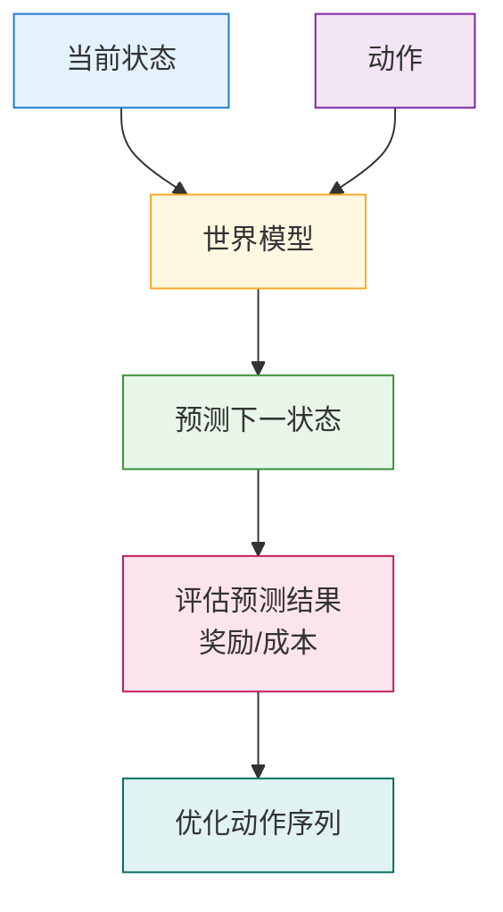

# 具身智能：当 AI 拥有身体，物理世界迎来新纪元

如果说 ChatGPT 代表着**离身智能（Disembodied AI）**的巅峰——一个无需身体、仅凭语言就能回答问题的超级大脑——那么 2025-2026 年正在发生的，则是 AI 的另一次跃迁：**给 AI 装上身体，让它真正走进物理世界**。

这就是**具身智能（Embodied AI）**。

> 建议搭配阅读：
>
> - [AI Agent 入门](agent.md)
> - [Agentic AI：从 Chatbot 到可行动的智能体](agentic-ai.md)
> - [多智能体协作入门](multi-agent.md)

---

## 1. 什么是具身智能

### 1.1 核心定义

**具身智能（Embodied AI）**是指将人工智能嵌入到物理实体（通常是机器人）中，使其能够：

- **感知**真实世界的物理环境（视觉、触觉、力觉、空间位置等）
- **理解**并推理物理规律（重力、摩擦力、物体 permanence 等）
- **规划**并执行物理动作（抓取、移动、操作工具等）
- **学习**并适应动态环境（Sim-to-Real 迁移、持续学习）

简单来说：
> **具身智能 = 大模型的"大脑" + 机器人的"身体" + 与物理世界的实时交互**

### 1.2 离身智能 vs 具身智能

| 维度 | 离身智能（如 ChatGPT） | 具身智能（如人形机器人） |
|------|----------------------|------------------------|
| **存在形式** | 纯软件，运行在云端 | 软硬件结合，物理实体 |
| **输入** | 文本、图像、音频 | 多模态传感器数据（视觉、力觉、触觉、IMU 等） |
| **输出** | 文本、代码、图像 | 物理动作（移动、抓取、操作） |
| **环境** | 数字世界 | 真实物理世界 |
| **反馈** | 人类评价 | 物理结果（成功/失败、碰撞、损坏） |
| **学习** | 离线训练，静态知识 | 在线学习，持续适应 |

**关键区别**：离身智能可以"纸上谈兵"，具身智能必须"知行合一"。

### 1.3 为什么现在才爆发

具身智能并非新概念，但 2024-2026 年迎来爆发点，核心驱动力包括：

1. **大模型的突破**：LLM/VLM 提供了强大的语义理解和推理能力
2. **端到端学习**：从感知到动作的联合优化成为可能
3. **硬件成本下降**：电机、传感器、算力成本大幅降低
4. **Sim-to-Real 技术成熟**：仿真到现实的迁移更加可靠
5. **产业需求拉动**：劳动力短缺、危险作业替代需求迫切

---

## 2. 三大技术路线

当前具身智能的技术架构主要分为三大类，各有优劣：

### 2.1 分层模型（Modular/Pipeline）

**架构**：感知模块 → 决策模块 → 执行模块，各模块独立训练



**优点**：  

- 模块化，易于调试和优化
- 可解释性强，故障定位容易
- 可以利用各领域成熟技术

**缺点**：  

- 模块间信息损失，误差累积
- 难以处理复杂的时空依赖
- 泛化能力有限

**代表**：传统工业机器人、早期自动驾驶方案

### 2.2 VLA（Vision-Language-Action）

**架构**：端到端模型，直接从视觉+语言输入映射到动作输出



**核心思想**：  

- 利用大规模互联网数据预训练视觉-语言理解能力
- 在机器人数据上微调，学习从语义到动作的映射
- 支持自然语言指令，零样本/少样本泛化

**优点**：  

- 端到端优化，减少信息损失
- 强大的语义理解和指令跟随能力
- 可以利用互联网规模的数据

**缺点**：  

- 需要大量机器人数据进行微调
- 对精细操作和长程任务仍有挑战
- 安全性和可解释性较弱

**代表**：  

- Google RT-1/RT-2/RT-X 系列
- 斯坦福 Mobile ALOHA
- 智元机器人启元大模型

### 2.3 世界模型（World Model）

**架构**：学习环境的动态模型，进行前瞻推演和规划



**核心思想**：  

- 学习环境的"物理规律"，预测动作后果
- 支持"想象"和"规划"，类似人类的心理模拟
- 可以大幅减少真实环境交互次数（样本效率）

**优点**：  

- 强大的泛化和迁移能力
- 支持长期规划和推理
- 样本效率高，Sim-to-Real 友好

**缺点**：  

- 世界模型训练难度大
- 预测误差会随时间累积
- 计算开销大

**代表**：  

- Yann LeCun 倡导的 JEPA 架构
- DeepMind 的 Dreamer 系列
- 特斯拉 FSD 的 World Model

### 2.4 技术路线对比

| 维度 | 分层模型 | VLA | 世界模型 |
|------|---------|-----|---------|
| **成熟度** | 高 | 中 | 低 |
| **数据需求** | 中等 | 大（机器人数据） | 中等 |
| **泛化能力** | 弱 | 强 | 最强 |
| **可解释性** | 强 | 弱 | 中 |
| **长程任务** | 弱 | 中 | 强 |
| **当前主流** | 工业界 | 学术界/初创 | 研究前沿 |

**趋势**：三种路线正在融合，形成**世界统一模型（World Unified Model）**——既有端到端的学习能力，又有世界模型的推演能力。

---

## 3. 关键技术挑战

### 3.1 Sim-to-Real 迁移

**问题**：仿真环境训练的策略，在真实世界往往失效

**原因**：  

- 仿真与现实的物理参数差异（摩擦、质量、刚度）
- 感知域差异（渲染 vs 真实图像）
- 未建模的动态因素

**解决方案**：  
 
- **域随机化（Domain Randomization）**：在仿真中随机化物理参数
- **域适应（Domain Adaptation）**：对齐仿真与真实的特征分布
- **数字孪生（Digital Twin）**：高精度建模真实环境
- **少量真实数据微调**：预训练+微调范式

### 3.2 灵巧操作

**问题**：精细的手部操作（如拧螺丝、叠衣服）仍是难题

**挑战**：  

- 高自由度控制（人手 20+ DOF）
- 触觉反馈的重要性
- 接触动力学复杂

**进展**：  

- Shadow Hand、Allegro Hand 等灵巧手硬件成熟
- 触觉传感器（GelSight、DIGIT）成本下降
- 模仿学习+强化学习结合

### 3.3 长程任务规划

**问题**：复杂任务需要多步骤规划（如"做一杯咖啡"）

**挑战**：  

- 动作序列长，搜索空间大
- 中间步骤失败需要重规划
- 常识推理与物理推理结合

**解决方案**：  

- 分层强化学习（HRL）
- 大模型作为高层规划器
- 世界模型进行推演验证

### 3.4 安全与鲁棒性

**问题**：物理世界出错代价高（损坏、伤人）

**要求**：  

- 安全边界约束（速度、力矩限制）
- 异常检测与紧急停止
- 人类在环（Human-in-the-loop）

---

## 4. 产业现状与关键玩家

### 4.1 2026：量产元年

2026 年被业界视为**通用人形机器人量产元年**：

- **智元机器人**：2026 年出货 5168 台，占全球 39% 份额
- **宇树科技**：占全球 32% 份额
- **六家中国企业**：2025 年出货量占全球 86.9%

**关键里程碑**：  

- 特斯拉 Optimus Gen 3 发布，目标 2026 年量产 5000-10000 台
- Figure AI 与宝马、亚马逊合作，进入工厂实测
- Agility Robotics Digit 在物流场景商业化落地

### 4.2 主要玩家

#### 国际阵营

| 公司 | 产品 | 特点 | 进展 |
|------|------|------|------|
| **特斯拉** | Optimus | 与 FSD 共享技术栈，成本控制 | Gen 3 发布，2026 年量产 |
| **Figure AI** | Figure 02 | 端到端 VLA，与 OpenAI 合作 | 融资 6.75 亿美元，进入宝马工厂 |
| **Agility** | Digit | 专注物流场景，双足+轮式混合 | 与亚马逊、GXO 合作 |
| **Boston Dynamics** | Atlas | 运动能力最强，液压驱动 | 被现代收购，转向电动 |
| **1X** | NEO/EVE | 柔性驱动，安全设计 | OpenAI 投资，挪威公司 |

#### 中国阵营

| 公司 | 产品 | 特点 | 进展 |
|------|------|------|------|
| **宇树科技** | H1/G1 | 高性价比，开源生态 | 占全球 32% 份额，Go2 四足已量产 |
| **智元机器人** | 远征 A2/灵犀 X1 | VLA 架构，启元大模型 | 2026 年出货 5168 台，全球第一 |
| **傅利叶智能** | GR-1 | 康复医疗背景 | 已量产，专注医疗场景 |
| **小鹏汽车** | PX5 | 车厂背景，与自动驾驶协同 | 2024 年发布，持续迭代 |
| **小米** | CyberDog/CyberOne | 消费级定位 | 四足已发售，人形研发中 |
| **追觅科技** | 通用人形机器人 | 扫地机背景，供应链优势 | 2023 年发布，快速迭代 |

### 4.3 应用场景

**当前落地场景**：

| 应用场景 | 核心功能 | 代表案例 |
|:---------|:---------|:---------|
| 🏭 **工业制造** | 汽车工厂：搬运、装配、质检<br>3C 制造：精密装配、上下料 | Figure 02 在宝马工厂搬运金属部件 |
| 📦 **物流仓储** | 分拣、搬运、码垛 | Digit 在亚马逊仓库处理周转箱 |
| 🏢 **商业服务** | 展厅讲解、导览接待 | 智元机器人在展厅做讲解员 |
| 🎓 **科研教育** | 算法验证、教学演示 | 宇树 H1 被全球多所高校采购 |

**未来潜在场景**：

- 家庭服务：清洁、烹饪、照护老人/儿童
- 医疗康复：辅助行走、康复训练
- 危险作业：核设施、化工、救援
- 太空探索：月球/火星基地建设

---

## 5. 具身智能与 AI Agent 的关系

很多读者可能会问：**具身智能和 AI Agent 是什么关系？**

### 5.1 概念对比

| 维度 | AI Agent | 具身智能 |
|------|---------|---------|
| **定义** | 能自主感知、决策、行动的 AI 系统 | 嵌入物理身体的 AI 系统 |
| **环境** | 数字世界（软件、API、数据库） | 物理世界（真实空间、物体） |
| **动作** | 调用工具、读写数据、发送请求 | 物理运动、抓取、操作 |
| **载体** | 软件程序、虚拟助手 | 机器人、自动驾驶汽车、无人机 |

### 5.2 关系图谱

```
AI Agent（智能体）
    ├── 软件 Agent（Software Agent）
    │       ├── 聊天机器人（Chatbot）
    │       ├── 代码助手（Coding Agent）
    │       └── 工作流自动化（Workflow Agent）
    │
    └── 具身 Agent（Embodied Agent）
            ├── 人形机器人（Humanoid Robot）
            ├── 自动驾驶（Autonomous Driving）
            ├── 无人机（Drone）
            └── 机械臂（Robotic Arm）
```

**核心关系**：
> **具身智能是 AI Agent 在物理世界的延伸**。AI Agent 提供"大脑"（感知、推理、规划），具身智能加上"身体"（传感器、执行器）和"物理交互"。

### 5.3 技术融合趋势

当前最前沿的方向是**将大模型 Agent 能力迁移到机器人**：

- **大模型作为高层规划器**：理解任务、拆解步骤
- **VLA 作为中层控制器**：将语义指令映射为动作
- **底层控制器**：处理实时反馈、保持稳定

这正是智元机器人、Figure AI 等公司的技术路线。

---

## 6. 2026 年开发者如何参与

### 6.1 学习路径

**入门阶段**：  

1. 了解机器人学基础（运动学、动力学、控制）
2. 学习 ROS/ROS2 机器人操作系统
3. 掌握强化学习基础（PPO、SAC）
4. 尝试仿真环境（Isaac Sim、Mujoco、PyBullet）

**进阶阶段**：  

1. 研究 VLA 模型（RT-1/RT-2、OpenVLA）
2. 学习模仿学习（Behavior Cloning、Diffusion Policy）
3. 探索世界模型（Dreamer、JEPA）
4. 参与开源项目（LeRobot、Open X-Embodiment）

### 6.2 开源资源

| 资源 | 类型 | 说明 |
|------|------|------|
| **Isaac Sim/Lab** | 仿真平台 | NVIDIA 出品，支持 GPU 加速 |
| **Mujoco** | 物理引擎 | DeepMind 开源，仿真精度高 |
| **PyBullet** | 物理引擎 | 轻量级，易上手 |
| **LeRobot** | 数据集+模型 | Hugging Face 开源机器人项目 |
| **Open X-Embodiment** | 数据集 | 大规模机器人学习数据集 |
| **ROS/ROS2** | 操作系统 | 机器人行业标准 |

### 6.3 硬件入门

**低成本入门方案**：  

- **机械臂**：UFACTORY xArm、Elephant Robotics myCobot
- **移动底盘**：TurtleBot、JetBot
- **人形**：宇树 Go2（四足，可升级）、智元灵犀 X1

**仿真先行**：  

- 无需硬件即可开始学习和算法验证
- Isaac Sim 支持数字孪生，可直接迁移到真实机器人

---

## 7. 挑战与未来展望

### 7.1 当前挑战

1. **成本**：人形机器人单价仍在 10-20 万人民币，难以大规模普及
2. **可靠性**：复杂环境下的长期稳定运行仍有挑战
3. **安全性**：物理交互的安全保障机制需要完善
4. **数据**：高质量机器人数据稀缺，数据收集成本高
5. **泛化**：从特定场景泛化到开放世界仍有距离

### 7.2 未来展望

**短期（2026-2028）**：  

- 工业场景规模化落地
- 成本降至 5-10 万人民币
- 特定场景（物流、制造）实现商业闭环

**中期（2028-2030）**：  

- 进入商业服务场景（零售、餐饮、酒店）
- 家庭场景初步尝试（清洁、简单照护）
- 成本降至 2-5 万人民币

**长期（2030+）**：  

- 家庭服务机器人普及
- 通用人工智能（AGI）与具身智能融合
- 机器人成为日常生活基础设施

### 7.3 给开发者的建议

> 1. **关注技术融合**：大模型 + 机器人 + 强化学习的交叉点
> 2. **重视仿真能力**：仿真是通往真实世界的捷径
> 3. **参与开源社区**：LeRobot、Open X-Embodiment 等
> 4. **选择细分场景**：不要试图做通用机器人，专注特定场景
> 5. **安全第一**：物理世界不可逆，安全机制必须优先

---

## 8. 小结

具身智能代表着 AI 从"数字世界"走向"物理世界"的关键一步。它不是简单的"给机器人装个大模型"，而是**感知、认知、行动**的深度融合。

2026 年作为量产元年，标志着具身智能从实验室走向产业化的转折点。无论是特斯拉、Figure AI 这样的国际巨头，还是宇树、智元这样的中国新锐，都在加速推动这一进程。

对于开发者而言，这是一个充满机遇的领域：  

- 技术栈正在快速成熟（仿真、开源数据集、预训练模型）
- 硬件成本持续下降
- 应用场景不断扩展

具身智能的未来，是让 AI 真正成为物理世界的参与者，而不仅仅是屏幕背后的对话者。

---

**本文作者：** [<span class="author-avatar-wrapper"><span class="author-name-popover">王科文</span></span>](https://github.com/Wcowin)

---

## 延伸阅读

- [AI Agent 入门](agent.md)
- [Agentic AI：从 Chatbot 到可行动的智能体](agentic-ai.md)
- [多智能体协作入门](multi-agent.md)
- [深度推理与测试时计算](deep-reasoning.md)

## 参考文献

### 行业研究报告

[1] Omdia. (2026). *Global General-Purpose Embodied Intelligence Robot Market Insight and Vendor Assessment Report 2026*. Omdia Research.

[2] 36氪研究院. (2026). *2026年具身智能产业发展研究报告*. 36氪.

[3] IDC China. (2025). *全球人形机器人市场预测报告*. International Data Corporation.

[4] 智研咨询. (2025). *2025年中国具身智能机器人行业发展环境及市场运行格局研究报告*. 智研咨询.

### 新闻报道

[5] 界面新闻. (2025). 智元机器人2025年出货量超过5100台，2026年预计可达数万台. *界面新闻*.

[6] 腾讯科技. (2026). 68亿订单遇上人形机器人"只卖4台"，具身智能产业化走到了哪一步?

### 技术论文

[7] Brohan, A., et al. (2022). *RT-1: Robotics Transformer for Real-World Control at Scale*. arXiv:2212.06817. Google Robotics.

[8] Chebotar, Y., et al. (2023). *Open X-Embodiment: Robotic Learning Datasets and Model Insights*. arXiv:2310.08864. Google DeepMind.

[9] Yu, T., et al. (2023). *Mobile ALOHA: Learning Bimanual Mobile Manipulation from Low-Cost Teleoperation*. arXiv:2401.02117. Stanford University.

### 官方资料与开源项目

[10] Tesla, Inc. (2024). *Optimus Bot - Tesla AI Day*. Retrieved from https://www.tesla.com/AI

[11] Unitree Robotics. (2025). *Unitree H1 Humanoid Robot Technical Documentation*. Retrieved from https://www.unitree.com.cn

[12] Figure AI, Inc. (2025). *Figure 02 Technical Overview*. Retrieved from https://www.figure.ai

[13] Hugging Face. (2024). *LeRobot: Open-Source Embodied AI*. Retrieved from https://github.com/huggingface/lerobot

[14] NVIDIA. (2025). *Isaac Sim - Robotic Simulation Platform*. Retrieved from https://developer.nvidia.com/isaac-sim

[15] ROS (Robot Operating System). (2025). *ROS 2 Documentation*. Retrieved from https://docs.ros.org

### 政策法规

[16] 国务院. (2025). *2025年国务院政府工作报告*. 中华人民共和国中央人民政府.

[17] 北京市人民政府. (2025). *北京市机器人产业创新发展行动方案(2025-2027年)*.

[18] 上海市人民政府. (2025). *"十五五"人形机器人产业发展规划*.
