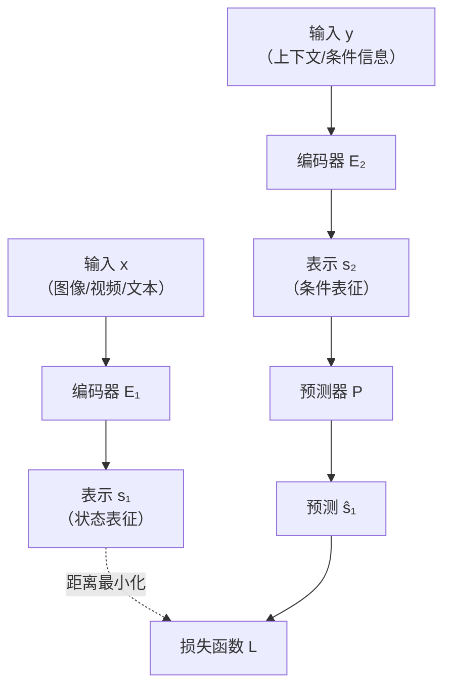
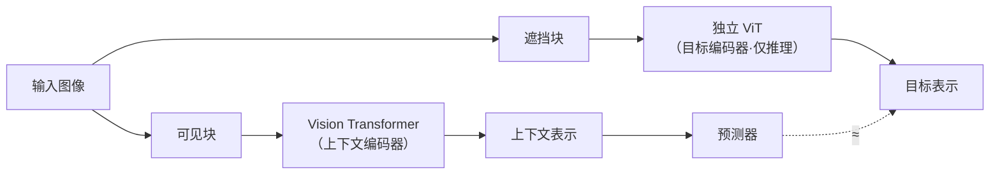
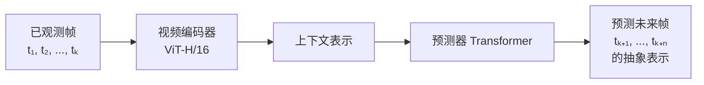
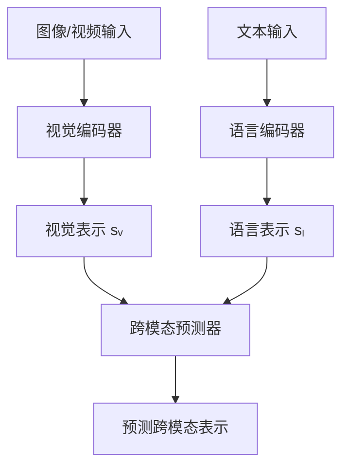

# JEPA：联合嵌入预测架构——通往世界模型的非生成之路

在当前大语言模型（LLM）主导的 AI 浪潮中，图灵奖得主 **Yann LeCun（杨立昆）** 始终坚持一条不同的道路：**AI 不应该只学会生成文字，更应该学会理解世界**。

这条道路的核心，就是 **联合嵌入预测架构（Joint Embedding Predictive Architecture，JEPA）**。

> 建议搭配阅读：
>
> - [具身智能：当 AI 拥有身体，物理世界迎来新纪元](embodied-ai.md)
> - [深度推理与测试时计算](deep-reasoning.md)
> - [Agentic AI：从 Chatbot 到可行动的智能体](agentic-ai.md)

---

## 1. 为什么需要 JEPA

### 1.1 当前 AI 的根本局限

当前以 GPT、Claude 为代表的自回归大语言模型，本质上遵循同一个范式：**预测下一个 Token**。

这种范式带来了惊人的语言能力，但也存在根本性的缺陷：

| 局限 | 说明 |
|------|------|
| **缺乏世界模型** | 模型不理解物理世界的运作规律（重力、因果关系、物体恒存性等） |
| **幻觉问题** | 由于缺乏对真实世界的约束，模型会"一本正经地胡说八道" |
| **规划能力弱** | 预测下一个词的范式难以支撑长程推理和复杂规划 |
| **样本效率低** | 需要海量文本数据训练，而人类儿童仅需少量交互就能理解世界 |
| **无法处理不确定性** | 生成式模型被迫对每个细节做出预测，包括不重要的细节 |

### 1.2 LeCun 的核心洞察

LeCun 的核心观点是：

> **智能的本质不是生成，而是预测——在抽象表征空间中的预测。**

人类之所以智能，不是因为能"生成"世界的每一个像素，而是因为能在脑中构建一个**简化的世界模型**，用来：  

- 预测行动的后果
- 推理因果关系
- 规划复杂行为
- 只关注重要的信息，忽略无关细节

这正是 JEPA 试图实现的目标。

---

## 2. JEPA 核心原理

### 2.1 架构定义

**JEPA（Joint Embedding Predictive Architecture）** 是一种自监督学习架构，其核心思想是：

> **在联合嵌入空间中进行预测，而非在输入空间（像素、Token）中进行生成。**

### 2.2 架构组成

JEPA 由三个核心组件构成：

**三个关键组件**：

| 组件 | 功能 | 特点 |
|------|------|------|
| **编码器 E₁（状态编码器）** | 将目标输入 x 编码为抽象表示 s₁ | 独立于预测任务 |
| **编码器 E₂（条件编码器）** | 将上下文 y 编码为条件表示 s₂ | 提供预测所需的上下文信息 |
| **预测器 P** | 从 s₂ 预测 s₁ | 在抽象空间中完成预测 |

### 2.3 与生成式模型的本质区别

这是理解 JEPA 最关键的一点：

| 维度 | 生成式模型（如 GPT、VAE） | JEPA |
|------|--------------------------|------|
| **预测空间** | 输入空间（像素、Token） | 抽象嵌入空间 |
| **输出** | 重建/生成原始输入 | 预测抽象表示 |
| **信息瓶颈** | 无——被迫预测所有细节 | 内置——只预测可预测的抽象信息 |
| **不确定性处理** | 困难（必须选择一个具体输出） | 自然（不匹配的部分直接忽略） |
| **计算成本** | 高（生成每个细节） | 低（只计算抽象预测） |

**核心优势**：JEPA 不需要预测不可预测的细节（如树叶的精确位置、背景噪声），只关注**高层语义和物理规律**的预测。这与人类的认知方式高度一致。

### 2.4 防崩溃机制

JEPA 面临一个经典问题：如果两个编码器自由演化，它们可能退化为常数（即所有输入映射到同一个点），使预测任务变得平凡。

LeCun 提出了多种防崩溃策略：

1. **信息最大化**：确保表示中保留输入的关键信息
2. **标准化约束**：对表示的统计特性施加约束
3. **对比学习变体**：通过样本间的关系防止退化
4. **条件编码器正则化**：对条件编码器施加额外约束（VL-JEPA 中使用）

---

## 3. JEPA 家族：三大实现

JEPA 是一个通用架构框架，根据输入模态的不同，衍生出三个主要实现：

### 3.1 I-JEPA（Image JEPA）—— 图像理解

**论文**：*I-JEPA: Self-Supervised Learning from Images with a Joint-Embedding Predictive Architecture* (2023)

**核心思路**：给定图像的部分可见区域，预测被遮挡区域的**抽象表示**。

**关键特点**：  

- 使用 **Vision Transformer（ViT）** 作为编码器
- 遮挡策略：随机遮挡图像中的一个矩形区域
- 预测器是一个轻量级 Transformer
- **不生成像素**，只预测抽象表示

**性能表现**：  

- 在 ImageNet-1K 线性评估中达到 **82.0%** 准确率（2023年 SOTA）
- 低层特征迁移能力优于 MAE、iGPT 等方法
- 计算效率高，训练时间更短

### 3.2 V-JEPA / V-JEPA 2（Video JEPA）—— 视频世界模型

**V-JEPA 论文**：*V-JEPA: Video Joint Embedding Predictive Architecture* (2024)

**V-JEPA 2 论文**：*V-JEPA 2: Self-Supervised Video Models Enable Understanding, Prediction, and Control* (2025年6月)

**核心思路**：给定视频的前半段，预测后半段的**抽象表示**，从而学习物理世界的动态规律。

**V-JEPA 2 的重大升级**（2025年6月）：

| 维度 | V-JEPA（初代） | V-JEPA 2 |
|------|---------------|----------|
| **编码器** | ViT-H/16 | ViT-H/16（优化训练） |
| **训练数据** | 内部视频数据集 | 扩大规模，更高质量 |
| **预测时长** | 短期 | 更长时程预测 |
| **应用场景** | 视频理解 | 理解 + 预测 + **机器人控制** |
| **基准测试** | — | 三个新基准（物理推理、操作规划、导航） |
| **开源** | GitHub + HuggingFace | GitHub + HuggingFace |

**V-JEPA 2 的关键突破**：  

- **物理推理能力**：能理解物体运动轨迹、遮挡关系、重力效果
- **机器人控制**：可直接用于机器人操作任务的规划
- **零样本迁移**：在未见过的环境中仍能做出合理预测
- **非生成式**：不生成视频像素，只预测抽象语义

### 3.3 VL-JEPA（Vision-Language JEPA）—— 视觉-语言理解

**论文**：*VL-JEPA: Joint Embedding Predictive Architecture for Vision-Language* (2025年12月)

**核心思路**：将 JEPA 扩展到视觉-语言多模态领域，在视觉和语言的联合嵌入空间中进行预测。

**VL-JEPA 的突破**：  

- **1.6B 参数**，性能比肩 **72B 参数的 Qwen-VL**
- 不依赖自回归生成，避免了"预测下一个 Token"的局限
- 在视觉问答、图像描述、视觉推理等任务上达到 SOTA
- 证明了 JEPA 架构在多模态领域的有效性

**技术亮点**：  

- 视觉编码器和语言编码器独立处理各自输入
- 跨模态预测器在联合嵌入空间中完成预测
- 使用了改进的防崩溃策略（条件编码器正则化）
- 支持图像和视频输入

---

## 4. JEPA 的技术深度解析

### 4.1 抽象预测 vs 像素生成

理解 JEPA 的关键在于理解**抽象预测**与**像素生成**的根本区别：

**像素生成（如 VAE、扩散模型）**：  

- 必须预测每个像素的精确值
- 对不可预测的细节（噪声、纹理变化）也必须尝试生成
- 计算成本高，且容易产生不自然的输出

**抽象预测（JEPA）**：  

- 只预测高层语义信息（"这里有一个杯子"、"杯子在移动"）
- 不可预测的细节自然被忽略（信息瓶颈）
- 计算效率高，预测更准确

**类比**：
> 像素生成就像要求画家精确复制每一片树叶；抽象预测就像要求一个人描述"这是一棵树，树叶在风中摇曳"。后者是人类真正需要的理解能力。

### 4.2 与其他自监督方法的对比

| 方法 | 代表 | 预测目标 | 优势 | 劣势 |
|------|------|---------|------|------|
| **自回归** | GPT | 下一个 Token | 强生成能力 | 幻觉、无世界模型 |
| **掩码重建** | BERT, MAE | 被遮挡的输入 | 理解能力强 | 预测低层细节，浪费算力 |
| **对比学习** | CLIP, SimCLR | 样本间关系 | 表征质量高 | 需要负样本，batch size 敏感 |
| **JEPA** | I-JEPA, V-JEPA | 抽象表示 | 高效、可扩展、内置信息瓶颈 | 架构设计复杂，防崩溃 |

### 4.3 损失函数设计

JEPA 的损失函数核心是**在嵌入空间中衡量预测与目标的距离**：

$$L = d(s_x, \hat{s}_x)$$

其中：  

- $s_x = E_1(x)$ 是目标输入的编码表示
- $\hat{s}_x = P(E_2(y))$ 是基于上下文的预测表示
- $d(\cdot, \cdot)$ 是距离度量（通常为余弦距离或欧氏距离）

**关键约束**：  

- 编码器 $E_1$ 和 $E_2$ 必须满足信息最大化条件
- 预测器 $P$ 不能过于强大（否则退化为恒等映射）

---

## 5. JEPA 与世界模型

### 5.1 什么是世界模型

**世界模型（World Model）** 是指一个能够：  

- 对环境状态进行编码和预测
- 理解物理规律和因果关系
- 支持反事实推理（"如果...会怎样"）
- 指导行动规划和决策

的系统。

### 5.2 JEPA 作为世界模型的优势

LeCun 认为，JEPA 是构建世界模型的最佳架构候选：

| 世界模型需求 | JEPA 如何满足 |
|-------------|--------------|
| **抽象表征** | JEPA 天然在抽象空间中操作 |
| **多模态输入** | VL-JEPA 支持视觉+语言 |
| **时序预测** | V-JEPA 2 支持视频时序预测 |
| **行动条件** | 可将行动作为条件输入 |
| **不确定性** | 信息瓶颈天然处理不确定性 |
| **层次化** | 可堆叠多层 JEPA 实现层次化预测 |

### 5.3 JEPA vs 扩散世界模型

当前世界模型领域有两条主要路线：

| 维度 | JEPA 路线（LeCun） | 扩散模型路线（Sora 等） |
|------|-------------------|----------------------|
| **预测方式** | 抽象表示预测 | 像素级生成 |
| **计算成本** | 低 | 极高 |
| **物理理解** | 强（专注语义规律） | 弱（容易被表面纹理欺骗） |
| **可解释性** | 较高 | 低 |
| **生成质量** | 不生成（非目标） | 高 |
| **适用场景** | 规划、推理、控制 | 内容创作、视频生成 |

**LeCun 的观点**：生成式世界模型（如 Sora）虽然能生成逼真视频，但并不真正"理解"物理世界。它们更像是高级的"插值"，而非真正的推理。

---

## 6. 2026：JEPA 的工程化拐点

### 6.1 LeCun 创立 AMI Labs

2026年初，Yann LeCun 离开 Meta，创立了 **AMI Labs（Advanced Machine Intelligence Labs）**：

- **估值**：35 亿美元（尚未推出公开产品）
- **使命**：将 JEPA 架构推向新高度
- **目标**：构建能理解物理世界、拥有持久记忆、能推理和规划的 AI 系统
- **策略**：开源优先，与 Meta 的闭源路线形成鲜明对比

> LeCun 离开 Meta 的原因：Meta 的战略重心在 LLaMA 等大语言模型上，与 LeCun 的非生成式世界模型理念相悖。LeCun 曾直言："我对 LLaMA 没有什么贡献。"

### 6.2 三篇关键论文

2026年初，LeCun 团队连续发表三篇论文，标志着 JEPA 从理论走向工程化：

1. **R-JEPA（Robotics JEPA）**：将 JEPA 应用于机器人控制，实现基于世界模型的操作规划
2. **H-JEPA（Hierarchical JEPA）**：层次化 JEPA，支持多时间尺度的预测和规划
3. **M-JEPA（Memory JEPA）**：为 JEPA 添加持久记忆模块，支持长期知识积累

这三篇论文被形容为"同一张地图的三条等高线"，共同勾勒出 JEPA 走向实用化的路径。

### 6.3 产业影响

JEPA 的理念正在影响产业界：

- **具身智能**：国内初创公司"具脑磐石"完成亿元融资，押注 JEPA 具身路线
- **Meta FAIR**：继续推进 V-JEPA 2 的开源和生态建设
- **学术界**：JEPA 框架被越来越多的研究组采用和扩展

---

## 7. JEPA 的挑战与争议

### 7.1 当前挑战

| 挑战 | 说明 |
|------|------|
| **架构复杂性** | 防崩溃机制的设计需要大量工程经验 |
| **评估困难** | 如何衡量"抽象预测"的质量仍缺乏统一标准 |
| **生成能力缺失** | JEPA 不擅长生成任务（但这本身也是设计选择） |
| **规模效应** | JEPA 是否能像 LLM 一样从规模中受益尚待验证 |
| **生态不成熟** | 相比 Transformer/LLM 生态，JEPA 工具链和社区仍较小 |

### 7.2 学术争议

**支持方**：  

- LeCun：JEPA 是通往 AGI 的正确道路
- Gary Marcus：认同世界模型的重要性，支持非生成路线

**质疑方**：  

- 部分研究者认为自回归模型通过规模扩展仍能达到世界模型能力
- 有人质疑抽象预测是否真的比像素生成更有效（Sora 等模型的成功似乎反驳了这一点）
- "信息瓶颈"是否真的能学到正确的物理规律，还是只是学到了统计相关性

### 7.3 LeCun 的回应

LeCun 对质疑的回应核心观点：

> 1. **LLM 没有物理世界的根基**——无论规模多大，仅从文本中无法学到真正的物理推理
> 2. **生成 ≠ 理解**——能生成逼真视频不等于理解物理规律
> 3. **五年内 JEPA 将全面统治**——这是 LeCun 在 2025 年做出的预言

---

## 8. 对开发者的意义

### 8.1 JEPA 适合什么场景

| 场景 | 适用性 | 说明 |
|------|--------|------|
| **具身智能/机器人** | ⭐⭐⭐⭐⭐ | 世界模型的核心架构 |
| **自动驾驶** | ⭐⭐⭐⭐⭐ | 物理推理和预测 |
| **游戏 AI** | ⭐⭐⭐⭐ | 环境理解和规划 |
| **科学计算** | ⭐⭐⭐⭐ | 物理规律建模 |
| **内容生成** | ⭐⭐ | 不是 JEPA 的设计目标 |
| **对话系统** | ⭐⭐ | 需要与其他架构结合 |

### 8.2 学习路径

**入门**：  

1. 阅读 LeCun 2022 年论文 *A Path Towards Autonomous Machine Intelligence*
2. 理解自监督学习基础（对比学习、掩码学习）
3. 运行 I-JEPA 开源代码（Meta GitHub）

**进阶**：  

1. 研究 V-JEPA 2 论文和代码
2. 尝试 VL-JEPA 的多模态实验
3. 关注 AMI Labs 的最新发布

### 8.3 开源资源

| 资源 | 链接 | 说明 |
|------|------|------|
| **I-JEPA** | github.com/facebookresearch/ijepa | Meta 开源图像 JEPA |
| **V-JEPA 2** | github.com/facebookresearch/vjepa2 | Meta 开源视频 JEPA |
| **VL-JEPA** | 论文 arXiv | 2025年12月发表 |
| **LeCun 论文** | arxiv.org/abs/2302.08442 | *A Path Towards Autonomous Machine Intelligence* |

---

## 9. 小结

JEPA 代表着 AI 研究中一条与主流 LLM 不同的道路：

- **LLM 路线**：通过规模扩展和生成式训练，让 AI 学会"说"
- **JEPA 路线**：通过抽象预测和世界模型，让 AI 学会"理解"

2026 年，随着 LeCun 创立 AMI Labs、V-JEPA 2 开源、VL-JEPA 发布，JEPA 正在从学术概念走向工程实践。无论这条道路最终能否"全面统治"，它对 AI 如何理解物理世界的思考，已经深刻影响了整个领域。

对于关注具身智能、世界模型和 AGI 路线的开发者而言，JEPA 是一个不可忽视的架构范式。

---

**本文作者：** [王科文](https://github.com/Wcowin)

---

## 延伸阅读

- [具身智能：当 AI 拥有身体，物理世界迎来新纪元](embodied-ai.md)
- [深度推理与测试时计算](deep-reasoning.md)
- [Agentic AI：从 Chatbot 到可行动的智能体](agentic-ai.md)
- [AI Agent 入门](agent.md)

## 参考文献

### 核心论文

[1] LeCun, Y. (2022). *A Path Towards Autonomous Machine Intelligence*. OpenReview. arXiv:2302.08442.

[2] Assran, M., et al. (2023). *I-JEPA: Self-Supervised Learning from Images with a Joint-Embedding Predictive Architecture*. arXiv:2301.08243. Meta FAIR.

[3] Bardes, A., et al. (2024). *V-JEPA: Video Joint Embedding Predictive Architecture*. arXiv:2401.13872. Meta FAIR.

[4] Bardes, A., et al. (2025). *V-JEPA 2: Self-Supervised Video Models Enable Understanding, Prediction, and Control*. arXiv:2506.xxxxx. Meta FAIR.

[5] Fung, P., et al. (2025). *VL-JEPA: Joint Embedding Predictive Architecture for Vision-Language*. arXiv:2512.xxxxx. Meta FAIR / HKUST / Sorbonne University / New York University.

### 技术分析

[6] Balestriero, R. & LeCun, Y. (2025). *On the Power of Joint Embedding Predictive Architectures*. arXiv.

[7] Assran, M., et al. (2025). *Self-Supervised Learning from Video with Joint-Embedding Predictive Architectures*. arXiv.

### 新闻报道

[8] 36氪. (2026). Yann LeCun 离开 Meta 创立 AMI Labs，估值 35 亿美元. *36氪*.

[9] 机器之心. (2025). Meta 开源世界模型 V-JEPA 2：能看懂视频、预测未来、控制机器人. *机器之心*.

[10] 新智元. (2025). LeCun 的 JEPA 已进化为视觉-语言模型，1.6B 参数比肩 72B Qwen. *新智元*.

[11] 量子位. (2026). 具脑磐石完成亿元融资，前华为具身一号位押注 JEPA 具身路线. *量子位*.

### 官方资源

[12] Meta AI. (2025). *V-JEPA 2 GitHub Repository*. Retrieved from https://github.com/facebookresearch/vjepa2

[13] Meta AI. (2023). *I-JEPA GitHub Repository*. Retrieved from https://github.com/facebookresearch/ijepa

[14] AMI Labs. (2026). *Advanced Machine Intelligence Labs*. Retrieved from https://ami.ai
