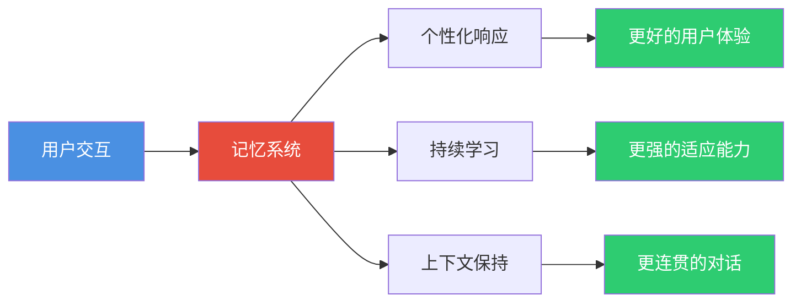
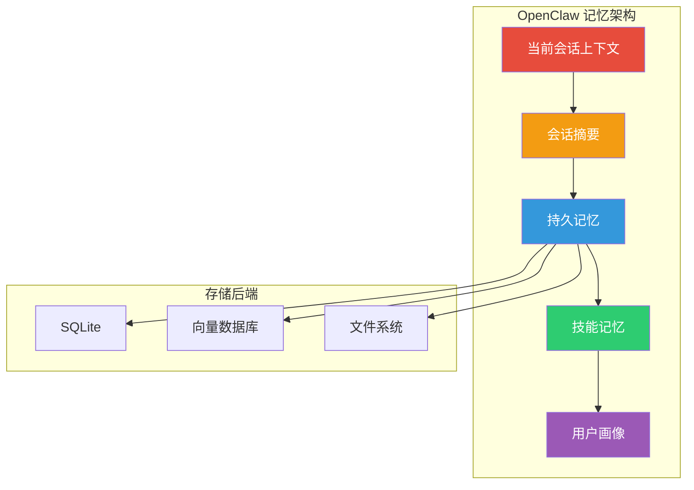

# AI Agent 记忆系统深度解析

> 为什么你的 Agent 总是"健忘"？为什么它记不住用户的偏好？为什么跨会话后就"失忆"？答案在于**记忆系统**的设计。本文将深入解析 AI Agent 记忆系统的核心概念、技术实现与最佳实践，帮助你构建真正"有记忆"的智能体。

**适用读者**：已了解 [AI Agent 入门](agent.md)、[Agentic AI](agentic-ai.md)，希望深入理解 Agent 记忆机制的开发者。

> 建议搭配阅读：
>
> - [RAG 技术深度解析](rag.md) — 检索增强生成，记忆系统的知识基础
> - [上下文工程](context-engineering.md) — 上下文管理与记忆注入
> - [OpenClaw 架构解析](openclaw.md) — 记忆系统的实际应用案例
> - [Hermes Agent](hermes-agent.md) — 自学习闭环中的记忆机制

---

## 1. 什么是 AI Agent 记忆系统

### 1.1 核心定义

**AI Agent 记忆系统**是指让智能体能够**存储、检索、更新和遗忘**信息的机制，使其具备跨会话、跨任务的持续学习能力。

简单来说：
> **记忆系统 = Agent 的"大脑硬盘" + "知识库" + "经验库"**

### 1.2 为什么需要记忆系统

传统 LLM 存在根本性的"失忆"问题：

| 问题 | 说明 | 影响 |
|------|------|------|
| **上下文窗口限制** | 即使是 128K/200K 窗口，也无法存储所有历史信息 | 长对话中丢失早期信息 |
| **无状态性** | 每次会话都是"从零开始" | 无法记住用户偏好、历史交互 |
| **知识截止** | 训练数据有时间限制 | 无法获取最新信息 |
| **无法学习** | 推理时不会更新知识 | 无法从错误中改进 |

### 1.3 记忆系统的核心价值



---

## 2. 记忆系统的分类

### 2.1 按时间维度分类

#### 短期记忆（Short-Term Memory）

**定义**：当前会话内的上下文信息，会话结束后消失。

**特点**：  

- 存储在上下文窗口中
- 访问速度极快（无需检索）
- 容量有限（受模型上下文长度限制）
- 会话结束后丢失

**典型内容**：  

- 当前对话历史
- 当前任务的中间状态
- 临时变量和计算结果

#### 长期记忆（Long-Term Memory）

**定义**：持久化存储的信息，跨会话保持。

**特点**：  

- 存储在外部数据库中
- 需要检索机制访问
- 容量几乎无限
- 永久保存（除非主动删除）

**典型内容**：  

- 用户画像和偏好
- 历史交互记录
- 学习到的知识和技能
- 经验和教训

#### 工作记忆（Working Memory）

**定义**：当前任务执行过程中的临时工作区。

**特点**：  

- 介于短期和长期之间
- 任务相关的上下文
- 任务完成后可能被清理或归档

**典型内容**：  

- 当前任务的计划和步骤
- 中间计算结果
- 待验证的假设

### 2.2 按存储内容分类

#### 语义记忆（Semantic Memory）

**定义**：关于世界的事实性知识。

**示例**：  

- "Python 是一种编程语言"
- "用户的邮箱是 user@example.com"
- "项目的数据库是 PostgreSQL"

#### 情景记忆（Episodic Memory）

**定义**：特定事件和经历的记忆。

**示例**：  

- "上周三用户询问过部署问题"
- "上次部署失败是因为端口冲突"
- "用户在 2024-03-15 纠正过我的命名风格"

#### 程序性记忆（Procedural Memory）

**定义**：如何执行特定任务的知识。

**示例**：
- "部署到 K8s 的步骤：构建镜像 → 推送仓库 → 更新 deployment"
- "代码审查时要检查安全性、性能、可读性"

---

## 3. 记忆存储技术

### 3.1 向量数据库

**原理**：将文本转换为向量嵌入，通过向量相似度进行检索。

**优势**：  

- 语义检索能力强
- 支持模糊匹配
- 适合非结构化数据

**主流方案**：

| 数据库 | 特点 | 适用场景 |
|--------|------|----------|
| **Pinecone** | 全托管，易用 | 快速原型，不想运维 |
| **Milvus** | 开源，高性能 | 大规模生产环境 |
| **Weaviate** | 开源，GraphQL API | 需要复杂查询 |
| **ChromaDB** | 轻量级，嵌入式 | 本地开发，小规模 |
| **Qdrant** | 开源，Rust 实现 | 高性能需求 |

**代码示例**（使用 ChromaDB）：

```python
import chromadb
from sentence_transformers import SentenceTransformer

# 初始化
client = chromadb.Client()
collection = client.create_collection("agent_memory")

# 存储记忆
def store_memory(text, metadata=None):
    collection.add(
        documents=[text],
        metadatas=[metadata or {}],
        ids=[str(hash(text))]
    )

# 检索记忆
def retrieve_memory(query, n_results=5):
    results = collection.query(
        query_texts=[query],
        n_results=n_results
    )
    return results['documents'][0]

# 示例
store_memory("用户偏好使用 Python 3.11", {"type": "preference"})
store_memory("项目使用 PostgreSQL 数据库", {"type": "project"})

results = retrieve_memory("用户喜欢什么编程语言？")
print(results)  # 输出: ["用户偏好使用 Python 3.11"]
```

### 3.2 关系数据库

**原理**：使用结构化表存储记忆，支持复杂查询。

**优势**：  

- 数据一致性好
- 支持复杂关联查询
- 事务支持

**适用场景**：  

- 用户信息管理
- 结构化知识存储
- 需要强一致性的场景

**Schema 示例**：

```sql
-- 用户画像表
CREATE TABLE user_profiles (
    user_id VARCHAR(64) PRIMARY KEY,
    name VARCHAR(128),
    preferences JSONB,  -- 存储偏好设置
    created_at TIMESTAMP DEFAULT NOW(),
    updated_at TIMESTAMP DEFAULT NOW()
);

-- 交互历史表
CREATE TABLE interactions (
    id SERIAL PRIMARY KEY,
    user_id VARCHAR(64) REFERENCES user_profiles(user_id),
    role VARCHAR(32),  -- user 或 assistant
    content TEXT,
    metadata JSONB,
    created_at TIMESTAMP DEFAULT NOW()
);

-- 知识条目表
CREATE TABLE knowledge (
    id SERIAL PRIMARY KEY,
    category VARCHAR(64),
    title VARCHAR(256),
    content TEXT,
    embedding VECTOR(1536),  -- 向量嵌入
    created_at TIMESTAMP DEFAULT NOW()
);
```

### 3.3 文件系统

**原理**：使用 Markdown、JSON 等文件存储记忆。

**优势**：  

- 简单直观
- 易于版本控制（Git）
- 人类可读

**适用场景**：  

- Agent 个人笔记
- 配置和偏好
- 文档化知识

**示例**（Hermes Agent 的 MEMORY.md）：

```markdown
# Agent 记忆

## 用户偏好  

- 用户偏好简洁的回复，不喜欢冗长的解释
- 用户使用 Python 3.11，偏好 async/await 语法
- 用户的时区是 UTC+8

## 项目信息  

- 当前项目：myapi（Rust Web 服务）
- 技术栈：Axum + SQLx + PostgreSQL
- 代码仓库：~/code/myapi

## 经验教训  

- 部署前必须运行测试套件
- 数据库迁移需要先备份
- 用户不喜欢在代码中使用 unwrap()
```

### 3.4 知识图谱

**原理**：使用图结构存储实体和关系。

**优势**：  

- 关系表达能力强
- 支持复杂推理
- 适合多跳查询

**适用场景**：  

- 复杂知识关系
- 需要推理的场景
- 多实体关联

**示例**（Neo4j）：

```cypher
// 创建实体
CREATE (u:User {name: "Alice", email: "alice@example.com"})
CREATE (p:Project {name: "myapi", language: "Rust"})
CREATE (s:Skill {name: "Rust Web 开发"})

// 创建关系
CREATE (u)-[:WORKS_ON]->(p)
CREATE (u)-[:HAS_SKILL]->(s)
CREATE (p)-[:USES]->(t:Technology {name: "Axum"})

// 查询：Alice 的项目使用了什么技术？
MATCH (u:User {name: "Alice"})-[:WORKS_ON]->(p:Project)-[:USES]->(t:Technology)
RETURN t.name
```

---

## 4. 记忆管理策略

### 4.1 记忆编码

**目标**：将原始信息转换为适合存储的格式。

**关键步骤**：

1. **信息提取**：从对话中提取关键信息
2. **实体识别**：识别人名、项目、技术等实体
3. **关系抽取**：提取实体间的关系
4. **向量化**：生成语义嵌入

**代码示例**：

```python
from openai import OpenAI

client = OpenAI()

def encode_memory(text):
    """将文本编码为向量"""
    response = client.embeddings.create(
        model="text-embedding-3-small",
        input=text
    )
    return response.data[0].embedding

def extract_entities(text):
    """使用 LLM 提取实体"""
    prompt = f"""
    从以下文本中提取关键实体和关系：
    {text}

    返回 JSON 格式：
    {{
        "entities": [
            {{"name": "实体名", "type": "类型", "description": "描述"}}
        ],
        "relations": [
            {{"source": "源实体", "target": "目标实体", "relation": "关系类型"}}
        ]
    }}
    """
    response = client.chat.completions.create(
        model="gpt-4",
        messages=[{"role": "user", "content": prompt}],
        response_format={"type": "json_object"}
    )
    return json.loads(response.choices[0].message.content)
```

### 4.2 记忆检索

**目标**：根据当前上下文，快速找到最相关的记忆。

**检索策略**：

| 策略 | 原理 | 适用场景 |
|------|------|----------|
| **语义检索** | 向量相似度匹配 | 模糊查询，语义相关 |
| **关键词检索** | 全文搜索 | 精确匹配，结构化查询 |
| **时间检索** | 按时间排序 | 最近的交互优先 |
| **混合检索** | 多种策略组合 | 综合效果最佳 |

**混合检索示例**：

```python
def hybrid_retrieve(query, user_id, top_k=5):
    """混合检索策略"""
    # 1. 语义检索
    semantic_results = vector_search(query, top_k=top_k*2)

    # 2. 关键词检索
    keyword_results = full_text_search(query, top_k=top_k*2)

    # 3. 时间加权
    time_weighted_results = apply_time_decay(
        semantic_results + keyword_results,
        decay_rate=0.1  # 每天衰减 10%
    )

    # 4. 去重排序
    final_results = deduplicate_and_rank(
        time_weighted_results,
        top_k=top_k
    )

    return final_results

def apply_time_decay(results, decay_rate):
    """应用时间衰减"""
    import time
    current_time = time.time()

    for result in results:
        age_days = (current_time - result['timestamp']) / 86400
        result['score'] *= (1 - decay_rate) ** age_days

    return results
```

### 4.3 记忆更新

**目标**：保持记忆的准确性和时效性。

**更新策略**：

```python
def update_memory(memory_id, new_info):
    """更新记忆"""
    # 1. 获取旧记忆
    old_memory = get_memory(memory_id)

    # 2. 判断是否需要更新
    if should_update(old_memory, new_info):
        # 3. 合并信息
        merged = merge_memory(old_memory, new_info)

        # 4. 重新编码
        new_embedding = encode_memory(merged['content'])

        # 5. 更新存储
        update_in_db(memory_id, merged, new_embedding)

        # 6. 记录更新历史
        log_update(memory_id, old_memory, merged)

def should_update(old, new):
    """判断是否需要更新"""
    # 时间衰减
    if is_outdated(old, max_age_days=30):
        return True

    # 信息冲突
    if conflicts(old, new):
        return True

    # 信息补充
    if is_more_complete(old, new):
        return True

    return False
```

### 4.4 记忆遗忘

**目标**：移除过时、错误或不重要的记忆。

**遗忘策略**：

| 策略 | 触发条件 | 处理方式 |
|------|----------|----------|
| **时间衰减** | 超过阈值时间 | 降低优先级或删除 |
| **冲突检测** | 发现矛盾信息 | 保留最新/最可靠的 |
| **重要性评估** | 重要性低于阈值 | 归档或删除 |
| **容量限制** | 存储空间不足 | 淘汰最不重要的 |

**代码示例**：

```python
def forget_strategy(memory):
    """遗忘策略"""
    # 1. 时间衰减
    if memory.age_days > 90:
        return "archive"

    # 2. 访问频率
    if memory.access_count < 3 and memory.age_days > 30:
        return "delete"

    # 3. 重要性评估
    if memory.importance_score < 0.3:
        return "delete"

    # 4. 冲突检测
    if has_conflicts(memory):
        return "resolve_conflict"

    return "keep"
```

---

## 5. 主流框架的记忆系统实现

### 5.1 OpenClaw 的记忆系统

OpenClaw 实现了**8 大上下文管理技术**，是目前最完整的记忆系统之一：



**核心特性**：

1. **自适应分块比例**：根据消息大小动态调整
2. **分阶段摘要**：分块摘要避免单次摘要超限
3. **第三方记忆增强**：支持 Mem0、Neutron 等
4. **跨会话记忆**：重启后仍保持完整记忆

### 5.2 Hermes Agent 的记忆系统

Hermes 实现了**三层记忆架构**：

| 层级 | 存储位置 | 容量 | 访问速度 | 持久性 |
|------|----------|------|----------|--------|
| **热记忆** | 系统提示词 | ~1,300 tokens | 即时 | 会话内 |
| **温记忆** | MEMORY.md + USER.md | ~1,300 tokens | 即时 | 永久 |
| **冷记忆** | SQLite + FTS5 | 无限 | 需检索 | 永久 |

**自学习闭环**中的记忆应用：


### 5.3 LangChain 的记忆组件

LangChain 提供了多种记忆组件：

```python
from langchain.memory import (
    ConversationBufferMemory,      # 完整对话历史
    ConversationSummaryMemory,     # 对话摘要
    ConversationBufferWindowMemory, # 滑动窗口
    ConversationKGMemory,          # 知识图谱记忆
    VectorStoreRetrieverMemory,    # 向量存储记忆
)

# 1. 缓冲记忆（最简单）
buffer_memory = ConversationBufferMemory(
    return_messages=True,
    memory_key="history"
)

# 2. 摘要记忆（适合长对话）
summary_memory = ConversationSummaryMemory(
    llm=ChatOpenAI(),
    memory_key="history"
)

# 3. 窗口记忆（平衡成本和效果）
window_memory = ConversationBufferWindowMemory(
    k=10,  # 保留最近 10 轮对话
    return_messages=True,
    memory_key="history"
)

# 4. 知识图谱记忆（适合复杂关系）
kg_memory = ConversationKGMemory(
    llm=ChatOpenAI(),
    memory_key="history"
)

# 5. 向量存储记忆（语义检索）
vector_memory = VectorStoreRetrieverMemory(
    retriever=vectorstore.as_retriever(),
    memory_key="history"
)
```

---

## 6. 记忆系统的挑战与优化

### 6.1 主要挑战

#### 信息过载

**问题**：记忆过多导致检索效率下降，噪音增加。

**解决方案**：  

- 分层存储（热/温/冷）
- 重要性评估和优先级排序
- 定期清理和归档

#### 记忆冲突

**问题**：新旧信息矛盾，导致行为不一致。

**解决方案**：  

- 时间戳标记，优先使用最新信息
- 冲突检测和自动解决
- 保留信息来源，支持人工审核

#### 隐私和安全

**问题**：记忆可能包含敏感信息。

**解决方案**：  

- 数据加密存储
- 访问控制和权限管理
- 定期审计和清理

#### 成本控制

**问题**：向量数据库和嵌入模型的成本。

**解决方案**：  

- 使用开源方案（ChromaDB、Milvus）
- 压缩嵌入维度
- 批处理和缓存

### 6.2 性能优化

#### 索引优化

```python
# HNSW 索引（推荐）
collection = client.create_collection(
    name="memories",
    metadata={"hnsw:space": "cosine"}  # 使用余弦相似度
)

# 批量插入
collection.add(
    documents=[...],
    embeddings=[...],
    ids=[...]
)

# 创建索引
collection.create_index()
```

#### 缓存策略

```python
from functools import lru_cache
import hashlib

@lru_cache(maxsize=1000)
def cached_retrieve(query_hash, top_k=5):
    """缓存检索结果"""
    return retrieve_memory(query_hash, top_k)

def retrieve_with_cache(query, top_k=5):
    """带缓存的检索"""
    query_hash = hashlib.md5(query.encode()).hexdigest()
    return cached_retrieve(query_hash, top_k)
```

#### 批处理

```python
def batch_store(memories, batch_size=100):
    """批量存储记忆"""
    for i in range(0, len(memories), batch_size):
        batch = memories[i:i+batch_size]
        collection.add(
            documents=[m['content'] for m in batch],
            metadatas=[m['metadata'] for m in batch],
            ids=[m['id'] for m in batch]
        )
```

---

## 7. 最佳实践与建议

### 7.1 设计原则

1. **分层存储**：根据访问频率和重要性分层
2. **渐进式加载**：只加载当前需要的记忆
3. **主动遗忘**：定期清理过时和不重要的记忆
4. **隐私优先**：敏感信息加密存储，严格控制访问

### 7.2 实施建议

#### 起步阶段

```python
# 最小可行记忆系统
class SimpleMemory:
    def __init__(self):
        self.short_term = []  # 当前会话
        self.long_term = {}   # 持久化存储

    def remember(self, key, value):
        self.long_term[key] = value

    def recall(self, key):
        return self.long_term.get(key)

    def forget(self, key):
        if key in self.long_term:
            del self.long_term[key]
```

#### 进阶阶段

```python
# 完整记忆系统
class AdvancedMemory:
    def __init__(self):
        self.vector_store = ChromaDB()
        self.graph_store = Neo4j()
        self.cache = Redis()

    def store(self, memory):
        # 1. 编码
        embedding = encode(memory.content)

        # 2. 存储到向量数据库
        self.vector_store.add(memory, embedding)

        # 3. 提取实体和关系
        entities, relations = extract(memory.content)

        # 4. 存储到知识图谱
        self.graph_store.add(entities, relations)

        # 5. 更新缓存
        self.cache.set(memory.id, memory)

    def retrieve(self, query, context):
        # 1. 缓存检查
        cached = self.cache.get(query)
        if cached:
            return cached

        # 2. 向量检索
        vector_results = self.vector_store.search(query)

        # 3. 图谱检索
        graph_results = self.graph_store.query(query)

        # 4. 融合排序
        results = merge_and_rank(vector_results, graph_results)

        # 5. 更新缓存
        self.cache.set(query, results)

        return results
```

### 7.3 常见陷阱

| 陷阱 | 问题 | 解决方案 |
|------|------|----------|
| **存储一切** | 噪音过多，成本高 | 实施重要性评估和遗忘策略 |
| **忽略冲突** | 行为不一致 | 实施冲突检测和解决机制 |
| **过度依赖向量** | 语义检索有局限 | 结合关键词和结构化查询 |
| **忽视隐私** | 安全风险 | 加密存储，访问控制 |
| **缺乏监控** | 问题难以发现 | 实施监控和告警 |

---

## 8. 未来展望

### 8.1 技术趋势

1. **多模态记忆**：不仅存储文本，还存储图像、音频、视频
2. **分布式记忆**：跨设备、跨平台的记忆同步
3. **联邦记忆**：在保护隐私的前提下共享记忆
4. **自适应记忆**：根据任务自动调整记忆策略

### 8.2 研究方向

1. **记忆压缩**：更高效的记忆编码和压缩算法
2. **记忆推理**：基于记忆的复杂推理能力
3. **记忆共享**：Agent 之间的记忆共享机制
4. **记忆安全**：对抗记忆投毒和隐私泄露

### 8.3 应用场景

1. **个人助手**：真正了解用户，提供个性化服务
2. **企业知识管理**：组织知识的自动积累和检索
3. **教育辅导**：根据学习历史调整教学策略
4. **医疗健康**：患者病史和治疗记录的智能管理

---

## 总结

记忆系统是 AI Agent 从"工具"进化为"伙伴"的关键。一个好的记忆系统应该：

1. **分层存储**：热/温/冷分层，平衡速度和容量
2. **混合检索**：语义 + 关键词 + 时间，综合效果最佳
3. **主动管理**：编码、检索、更新、遗忘，全生命周期管理
4. **隐私安全**：加密存储，访问控制，合规使用

**记住**：记忆系统不是越多越好，而是越"智能"越好。目标是让 Agent 像人类一样，记住重要的，遗忘无关的，在需要时快速回忆。

---

## 参考资料

- [OpenClaw 记忆系统文档](https://github.com/openclaw/openclaw)
- [Hermes Agent 记忆架构](https://github.com/NousResearch/hermes-agent)
- [LangChain Memory 组件](https://python.langchain.com/docs/modules/memory/)
- [向量数据库对比](https://benchmark.vectorview.ai/vectordbs.html)
- [Mem0 - AI 记忆层](https://mem0.ai/)
- [认知心理学中的记忆理论](https://en.wikipedia.org/wiki/Theory_of_memory)
