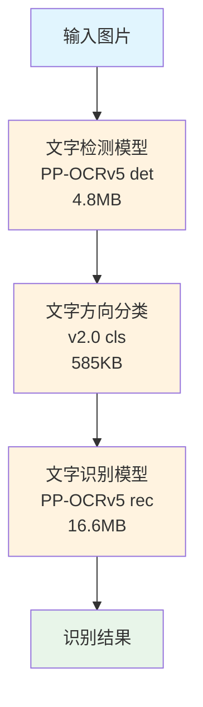

# PP-OCRv5 OCR 识别方案使用指南

## 简介

基于 PaddleOCR v5 的轻量级 OCR 识别方案，通过 ONNX Runtime 实现离线文字识别。支持中英文混排，无需 GPU，总大小仅 22MB。目前已经作为 [OneClip](https://github.com/Wcowin/OneClip) 的次选OCR 引擎。

## 一键下载

<div class="grid cards" markdown>

-   :material-download:{ .lg .middle } **下载模型文件**

    ---

    一键下载 PP-OCRv5 模型包（22MB）

    [:material-github: 下载](https://gitee.com/Wcowin/homebrew-oneclip/releases/tag/1.0.0){ .md-button .md-button--primary }

</div>

!!! tip "下载说明"
    - 文件大小：约 22MB
    - 格式：ZIP 压缩包
    - 包含：3 个 ONNX 模型文件
    - 解压后即可使用

## 技术架构



## 文件清单

| 文件名 | 大小 | 说明 |
|--------|------|------|
| `ch_PP-OCRv5_det_infer.onnx` | 4.8MB | 文字检测模型 |
| `ch_PP-OCRv5_rec_mobile_infer.onnx` | 16.6MB | 文字识别模型 |
| `ch_ppocr_mobile_v2.0_cls_infer.onnx` | 585KB | 文字方向分类模型 |
| **总计** | **22MB** | |

## 环境要求

- Python 3.7+
- 操作系统: macOS / Windows / Linux
- 无需 GPU，CPU 即可运行

## 安装

### 方式一：pip 安装（推荐）

```bash
pip install rapidocr-onnxruntime
```

### 方式二：手动安装

```bash
pip install numpy onnxruntime opencv-python pillow
```

## 快速开始

### Python 调用

```python
from rapidocr_onnxruntime import RapidOCR
import time

# 初始化 OCR
ocr = RapidOCR(
    det_model_path="ch_PP-OCRv5_det_infer.onnx",
    rec_model_path="ch_PP-OCRv5_rec_mobile_infer.onnx",
    cls_model_path="ch_ppocr_mobile_v2.0_cls_infer.onnx"
)

# 识别图片
start = time.time()
result, elapse = ocr("test.png")
elapsed = time.time() - start

# 输出结果
if result:
    for line in result:
        print(f"识别: {line[1]}")
else:
    print("未识别到文字")

print(f"耗时: {elapsed:.3f}s")
```

### 输出格式

```python
# result 格式: [(box, text, score), ...]
# box: 文字区域坐标
# text: 识别出的文字
# score: 置信度 (0-1)

result = [
    ([[[x1,y1], [x2,y2], [x3,y3], [x4,y4]], "Hello World", 0.98),
    ([[[x1,y1], [x2,y2], [x3,y3], [x4,y4]], "你好世界", 0.95),
]
```

## Python 脚本方式

如果不想安装 Python 库，可以使用独立脚本 `ocr_helper.py`：

```bash
python3 ocr_helper.py /path/to/image.png
```

输出 JSON 格式：

```json
{
  "success": true,
  "text": "识别出的文字内容"
}
```

## 性能指标

| 指标 | 数值 |
|------|------|
| 检测精度 (Hmean) | 84.1% |
| 识别精度 | 81.29% |
| 单图耗时 (CPU) | 0.8-1.2s |
| 模型大小 | 22MB |
| 支持语言 | 中文、英文、日文、拼音等 |

## 支持的图片格式

- PNG
- JPEG
- BMP
- TIFF
- WebP

## 与其他方案对比

| 方案 | 大小 | 速度 | 精度 | 离线 |
|------|------|------|------|------|
| **PP-OCRv5 (本方案)** | 22MB | 快 | 高 | ✅ |
| Tesseract | 15MB | 中 | 中 | ✅ |
| EasyOCR | 1GB+ | 慢 | 中 | ✅ |
| 商业 API | - | 中 | 高 | ❌ |

## 常见问题

### Q: 如何提高识别精度？

A: 确保图片清晰，文字区域尽量水平。可使用 `mode=quality` 参数（如果使用新版 RapidOCR）。

### Q: 支持多语言吗？

A: 默认支持中文和英文。如需其他语言，需下载对应语言的识别模型。

### Q: 内存占用多少？

A: 约 100-200MB，适合资源受限的环境。

### Q: 如何在移动端使用？

A: PaddleOCR 官方提供 Android 和 iOS 部署方案，详见官方文档。

## License

Apache 2.0 (遵循 PaddleOCR 开源协议)

## 相关链接

- [PaddleOCR GitHub](https://github.com/PaddlePaddle/PaddleOCR)
- [RapidOCR 文档](https://rapidai.github.io/RapidOCRDocs/)
- [ONNX Runtime](https://onnxruntime.ai/)

**本文作者：** [<span class="author-avatar-wrapper"><span class="author-name-popover">王科文</span></span>](https://github.com/Wcowin)  

未经允许不得转载😀